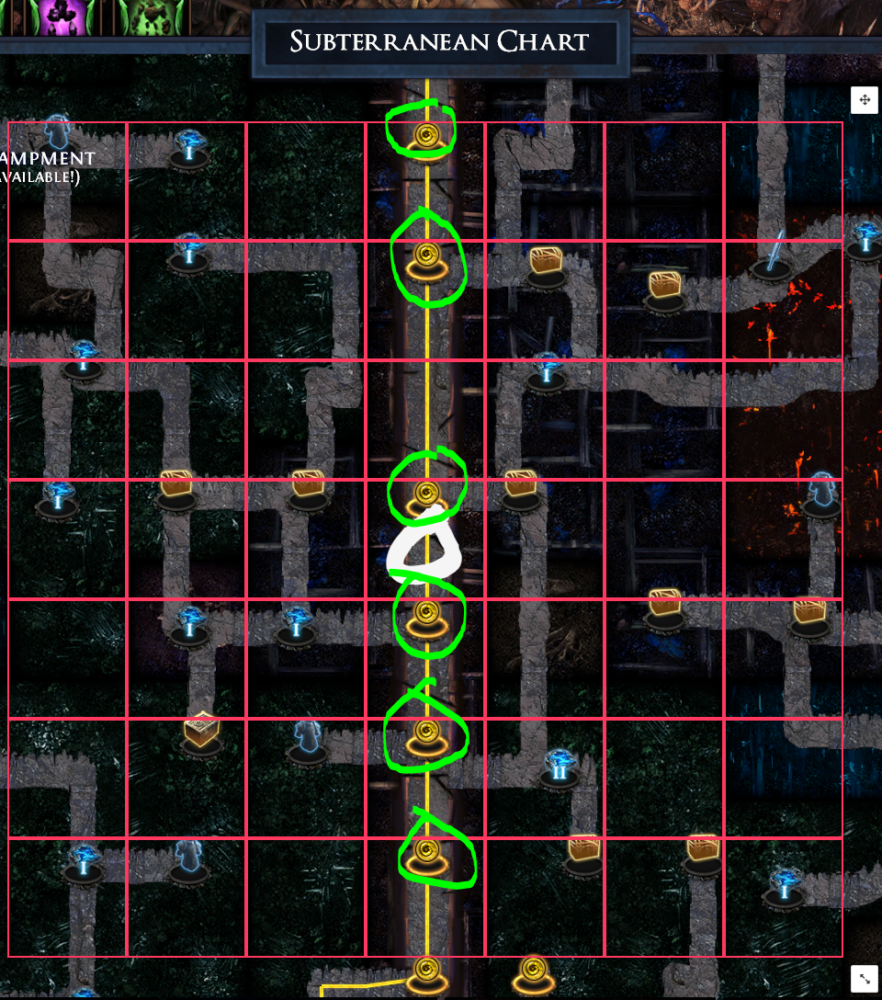
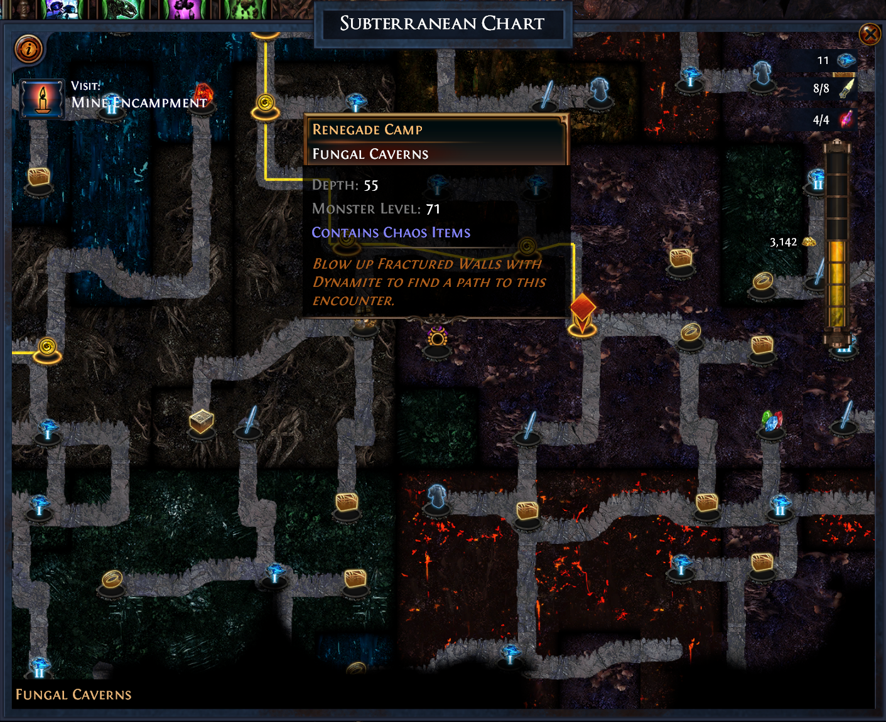
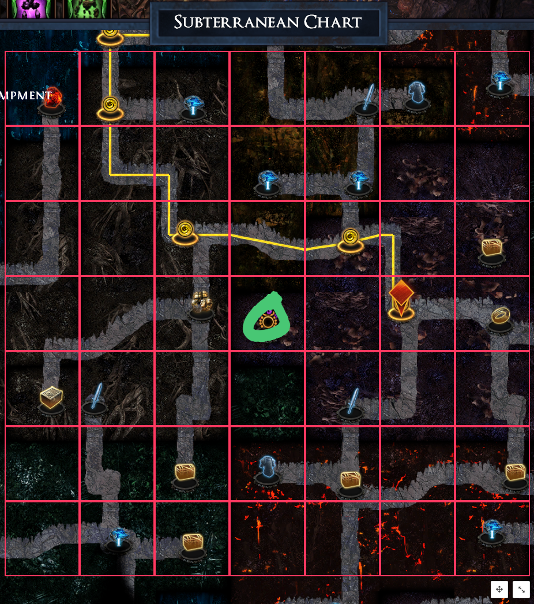
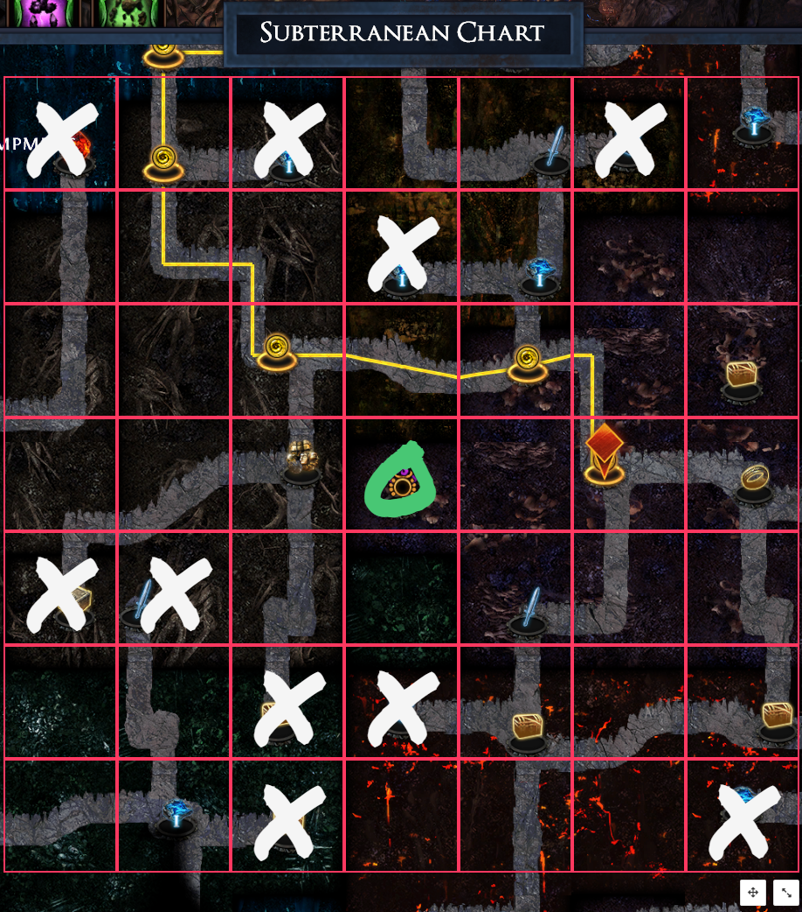
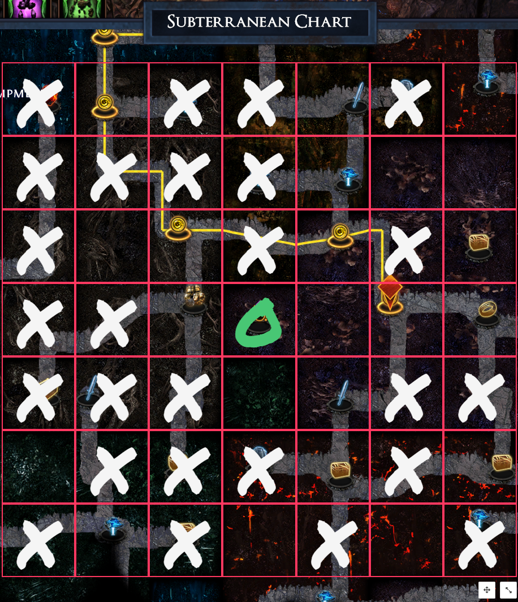
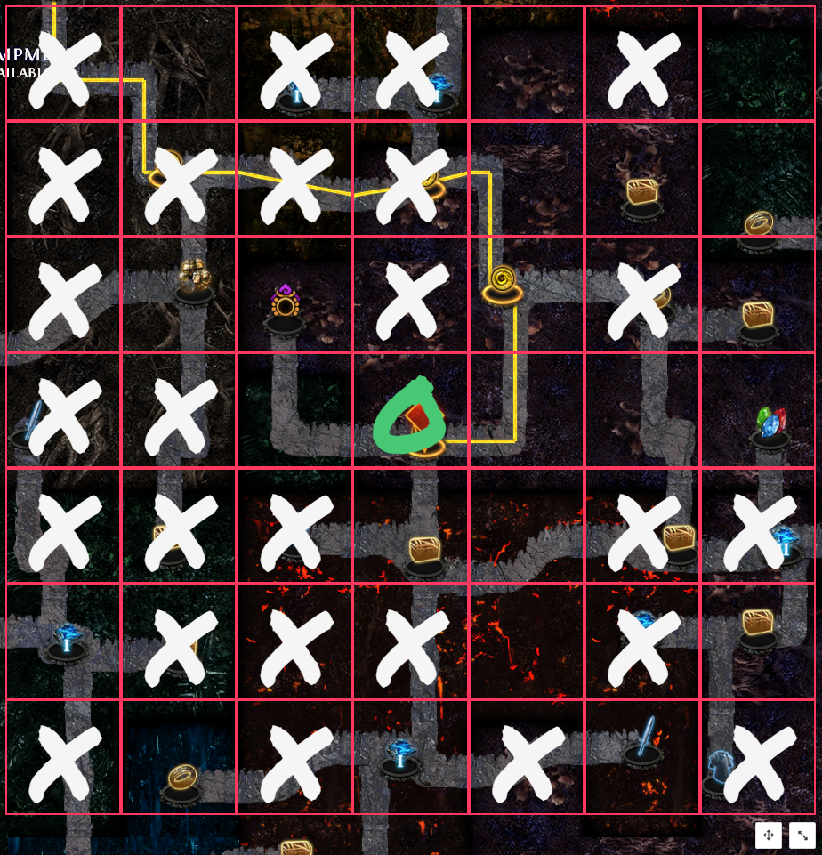
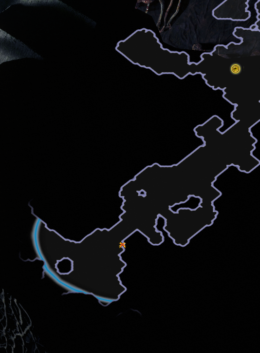

# Delve Champ

Feel free to open an issue for bugs and feature requests.

## Setup

1. Use the central mine shaft to resize the grid to the appropriate scale since these nodes are always equally spaced apart
1. Zoom in as close as possible on the chart before setting the grid's scale
1. Scale the grid so that the tops of the central mine shaft nodes align with the top of the corresponding gridline (see image below)
1. If you adjust your chart's zoom level, remember to zoom back in to the same zoom level to which you scaled your grid in the previous step



## Finding hidden nodes

1. Given a hidden node in the center of your Subterranean Chart 
1. Drag the move handle (located under the grid) to reposition the center "O" onto the hidden node 
1. Cross out dead-end nodes by clicking on each cell 
1. Cross out non-node paths.  These can't contain the fractured wall because the path must start from a real node. 
1. At this point you can look for any 2-path nodes -- that is probably the node that has the path to the fractured wall with the hidden node.  Visit the node and use the minimap to find the fractured wall in the darkness.  In the above example, I would explore the top and left sides of the weapon node to the bottom-right of the hidden node in the picture looking for the hidden path. 
1. This fractured wall was on the left side 

## Development

```
npm i
npm start
```
